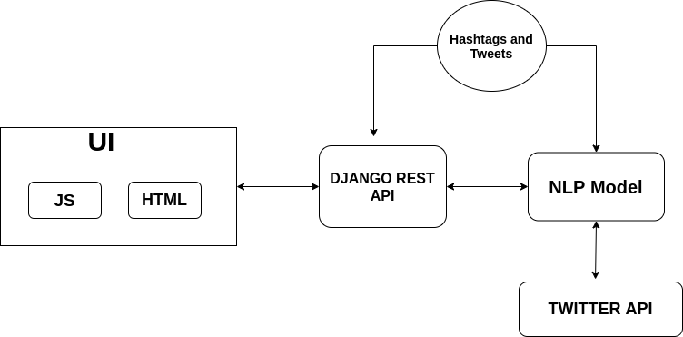

# Redefining Trending Hashtags
* Twitter provides an option to search for the latest trending hashtags, the objective is to create awareness about the recent trends, be it political, entertainment or sports.
* Only Top 30 Recent trends are currently displayed, with the objective to bring only the most popular trends to the user.
* 
## Problem Statement
* Frequently it happens that people use 2-3 hashtags, for the same content to promote their campaign. In such cases instead of top 30 trends we see only 10-15 different trends. 
* In case, the content relevant to us might not reach top 30 due to similar hashtag 
* Thus it defeats the objective of twitter hashtags 

## Solution

* We devised a solution, to clutter similar hashtags using their usage with other hashtags and improving this result using AI to check similarity.
* The final product also works on similar hashtags written in different languages
* To further improve user engagement we have added an intensity bar to show the intensity(number of tweets) for any given hashtag
## Instructions to use backend

Before starting off with the project, there are some dependencies that need to be installed in order to make the project work flawlessly.

In order to install python based libraries that make use of Twitter API under the hood, we need to install tweepy and twitter from pip using:

```pip install tweepy```
```pip install twitter```


Having done that, we need geoencoder (Python Library) to find longitude and latitude for given location. We install it using pip using:

```pip install geoencoder```

That done, we need to set up our NLP models before proceeding. We make use of Doc2Vec model which is already implemented using gensim. We install gensim for that using:

```pip install gensim```

The Doc2Vec makes use of pretrained models (English Wikipedia DBOW & Associated Press News DBOW) both of which can be found [here](https://github.com/jhlau/doc2vec).

The files of English Wikipedia DBOW are saved as ```doc2vec1``` and Associated Press news DBOW are saved as ```doc2vec2``` in the local file where the backend is run.


Finally, we need the django based rest api installed, instructions of which can be found [here](https://www.django-rest-framework.org/).

After installing everything mentioned above, we need to run the server. We can do that using:
```python manage.py runserver 0.0.0.0:8080```

This runs the server locally on ```127.0.0.1:8080```.
We can make ```POST``` API requests using ```127.0.0.1:8080/trendingtweets/``` on Postman or the UI in which it is being used.
This API request returns the clustered hashtags in the form of JSON which is processed by frontend to show beautiful results.




